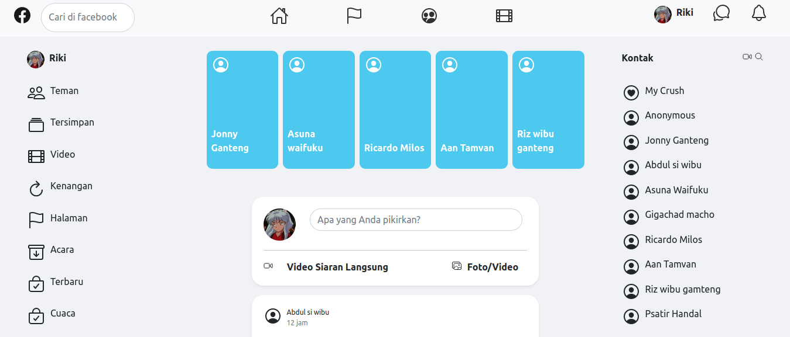

## Facebook UI

Hello, i tried to clone facebook ui using html css and bootstrap framework and this is what i got

for temporary view you can click [here](https://sharp-bell-b78871.netlify.app/), i have done it yet but i am quite like it.

you want me to design your website? i have service on fiver, you can click [here](https://www.fiverr.com/share/KbBDZY) to view.